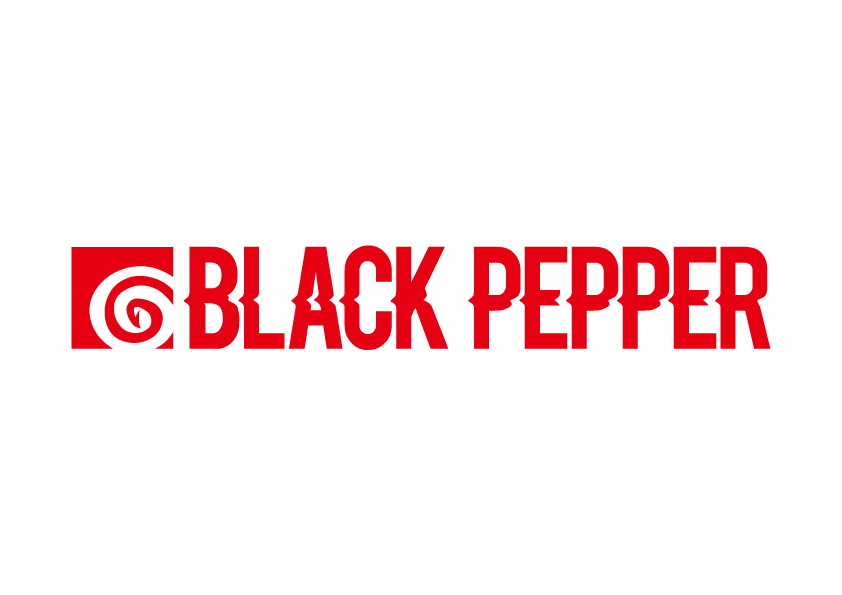
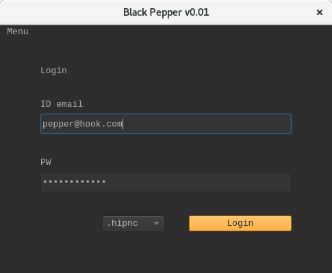
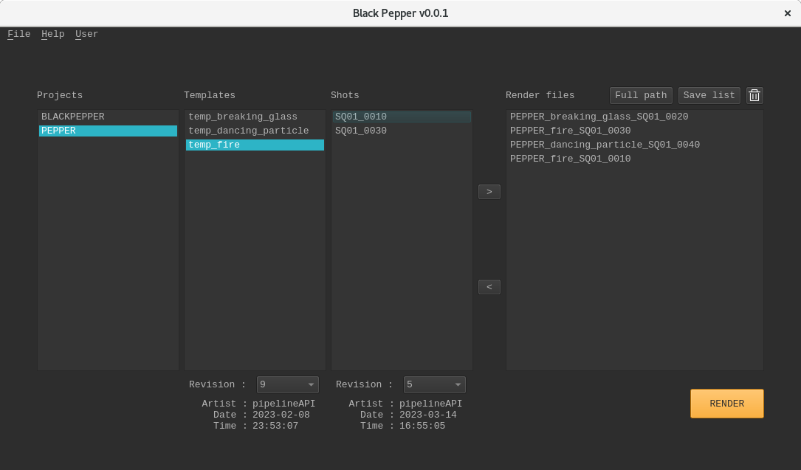
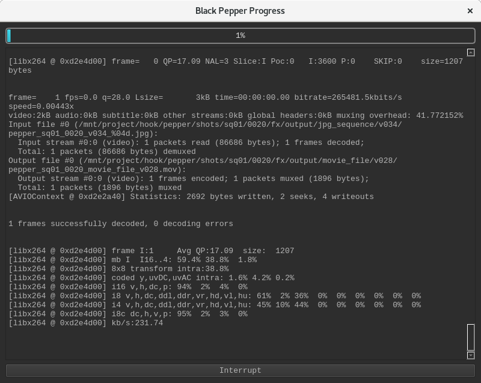
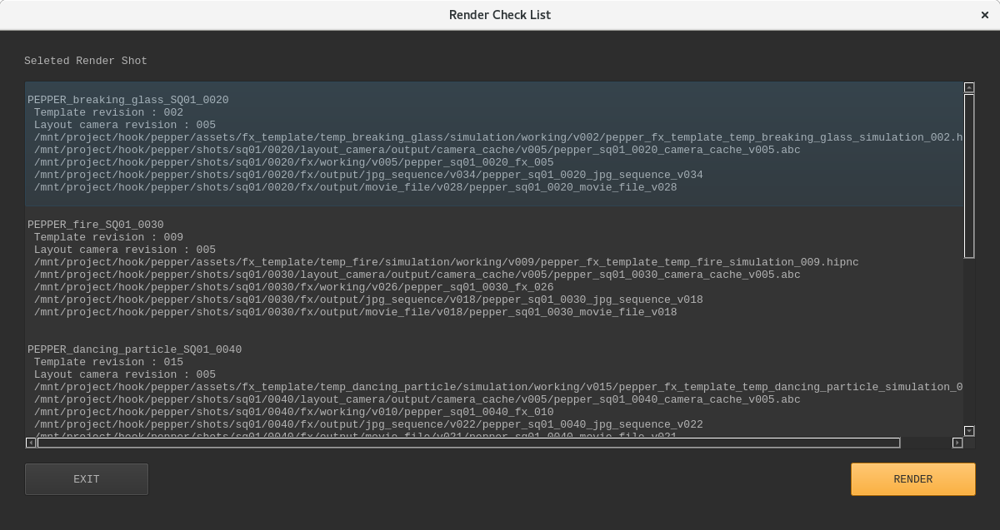

# This repository is a clone of a team project : BlackPepper
> I talked to other team members and moved the project from Jetbrains Space to GitHub.\
> Parts I worked: Developed the main logic of UI(model.py, controller.py, view.py) and pepper.py(Wrapper API of Gazu)
> 
***
# Black Pepper
### Black Pepper is a tool that setups Houdini scene with FX templates
***
## What is Kitsu & Gazu?
* Kitsu is a collaboration platform
  * https://github.com/cgwire/kitsu
* Gazu is Python API of Kitsu
  * https://github.com/cgwire/gazu
***
## How to use
1. Run tool and log in Kitsu
2. Select project, template to use, and shots to set templates
3. Press render
4. You'll get each shot's Houdini scene file set with the selected template and their slap-comp images!
***

## Modules
* pepper.py
  * Wrapper API of Gazu, gets data from Kitsu
* auto_login.py
  * A module that stores user information for automatic login
* controller.py
  * The main module of UI that connects model and view and display data with .ui files
* model.py
  * A module that have model classes that each class inherits QAbstractListModel
* viewer.py
  * A module that have view classes that each class inherits QListView
* houpepper.py
  * A module that gets camera data from alembic cache and makes 
* render_process_bar
  * A module that displays render progress status
* mantra_render
  * A module that sets Mantra renderer to render the Houdini scene
* moduler_log
  * A module that logs user login and data publishing
***
## UI Design 
* Login window

* Main window

* Render progress window

* Render path checker window

***
# Contributors
### Sunjun Park
### Sungwoo Park
### Jinkwang Park
### Yeolhoon Yoon
### Wongyu Lee
### Jaehyuk Lee

***
# *** License Copyright ***

### Netflix Academy 1st class Team Hook

#### The tool was developed by the Hook team during the Netflix Academy course.